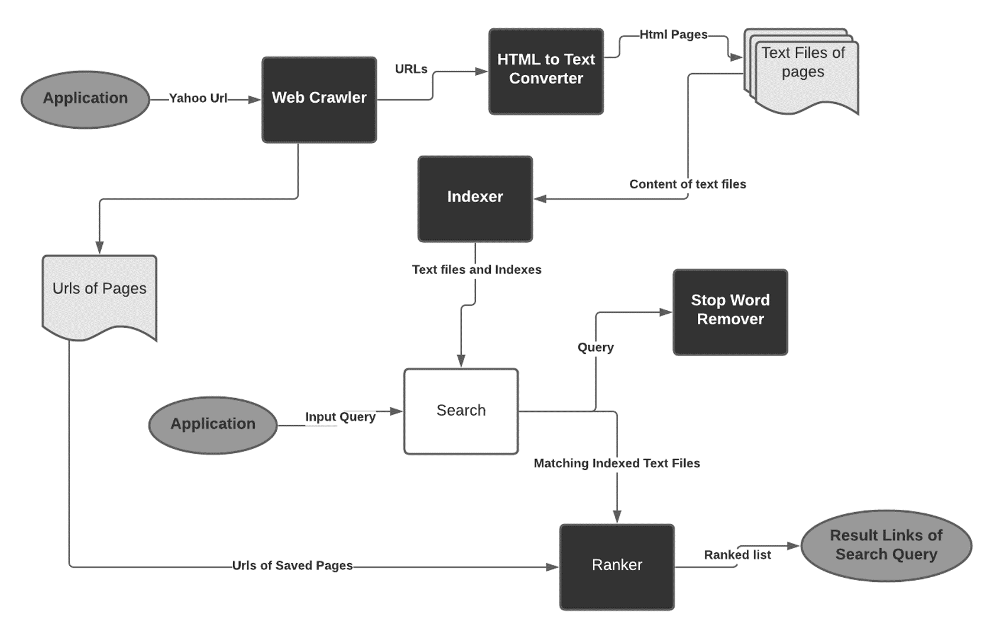

# Web-Search-Engine 

In simple words ,it is a system where user provides the query to be search and the system displays results which is found on the web.
In technical terms it is a software service that allows Internet users to perform search operation for content via World wide web. The information to be search is known as web search query.
The search results are represented as lines of results  often referred as Search Engine Result Pages(SERPS).
The information may be a mix  links of web pages, images , videos, articles , research papers .

# Block Diagram of Working 

# Tools and Technologies
 * Eclipse IDE  for Java development.
 * JSoup Library.
 *  Snowball API for Porter Stemming Algorithm
 
# Functionalities Implemented 
* Web Crawler
* Indexing
* Porter Stemming Algorithm
* Removing Stop words
* Ranking web pages

# Web Crawler 
A web crawler is  a program which navigates the web and finds new or updated pages .It downloads the pages from the website and then starts indexing the content found on the pages.
#### **How it is implemented?** 
  We have crawled 100 web pages from Yahoo news locally and downloaded them.

# Indexing 
In indexing , we have used inverted indexing.
Inverted indexing is an index data structure storing a mapping from content such as words or numbers , to its location in one or more documents .
It is like a hash map structure .
It directs you from a word to a document or a webpage.
#### **How it is implemented?** 
We have created an inverted index for all the words from all the text files of web pages using a hash map  where key is the  word and value is list of all the files  where the word is found.

# Porter Stemming Algorithm 
This algorithm is a process used for removing the commoner morphological and inflexional endings from words in English.
Example: EED -> EE means “if the word has at least one vowel and consonant plus EED ending, change the ending to EE” as ‘agreed’ becomes ‘agree’. 
Another example is word “connected” will give results “connect”.
#### **How it is implemented?** 
We have used an API for Porter Stemming to increase the capability of the search engine.

# Removing Stopwords 
Stop words are words which are filtered out before or after processing of natural language data (text). Though "stop words" usually refers to the most common words in a language, 
there is no single universal list of stop words used by all natural language processing tools, and indeed not all tools even use such a list.  Every user search query may have stop words like to , you and many others which are not useful to get the exact data.
It will consume extra space in memory which will slow down the search process.
#### **How it is implemented?** 
 We have created a list of stop words and removed them before creating  inverted index of all the web pages.

# Ranking of Web Pages
To get more relevant results, ranker is used based the user search query.Ranker algorithm is Collection.sort() as it is easy to use with Hash Map.
#### **How it is implemented?**  
The result is sorted based on the frequencies of the words.

# Web Search Process
First all the web pages are downloaded and stored locally from yahoo news – Web Crawling .
All the webpages are converted from Html to Text format using Jsoup Library.
Stop words and Porter Stemming algorithm is used to remove unnecessary words. 
An Inverted Index for all the words from all the text files of web pages using a hash map variable.
When the user enters a search query, program first removes the stop words and search for the query. Then it provides the links which matches the searched query.

In simple words , The process starts with web crawler which downloads around 100 pages from yahoo news.
These pages are then converted from html to text format using JSOUP and saved  locally using urls as their respective filename. Once all the pages are saved, all the words from all the pages will be mapped with their respective files using inverted index. Now, when user search for something, we will first remove stop words from the searched query and stem out the words where necessary. Then the resultant query will be searched in our index and results will be ranked and displayed to the user. We have programmed our search engine to show 10 results at a time and user can press 1 to get more results. So, this is how our web search engine works.

# References
#### [1]” Search engine - Wikipedia.” https://en.wikipedia.org/wiki/Search_engine (accessed: Nov. 23, 2020).
#### [2] “What is Web Crawling: A Beginner’s Guide.” https://thesiliconreview.com/2020/11/what-is-web-crawling-a-beginners-guide (accessed: Nov. 24, 2020).
#### [3] “jsoup - Basic web crawler example - Mkyong.com.” https://mkyong.com/java/jsoup-basic-web-crawler-example/ (accessed: Nov. 24, 2020).
#### [4] “jsoup Java HTML Parser, with the best of HTML5 DOM methods and ..” https://jsoup.org/  (accessed: Nov. 25, 2020).
#### [5] “Write HashMap to Text File in Java Example - Java Code Examples.” https://www.javacodeexamples.com/write-hashmap-to-text-file-in-java-example/2353 (accessed: Nov. 30, 2020).
#### [6] “Inverted Index - GeeksforGeeks.” https://www.geeksforgeeks.org/inverted-index/ (accessed: Nov. 30, 2020).
#### [7] “PorterStemmer (Lucene 7.2.0 API).” https://lucene.apache.org/core/7_2_0/analyzerscommon/org/tartarus/snowball/ext/PorterStemmer.html (accessed: Nov. 30, 2020).
#### [8] “List of Stop Words for SEO.” https://www.shoutmeloud.com/seo-stop-words (accessed: Dec. 01, 2020).
#### [9] “Removing Stopwords from a String in Java | Baeldung.” https://www.baeldung.com/java-string-remove-stopwords (accessed: Dec. 04, 2020).

# I would like to thank you everyone for their valuable time .Also , I would like to thank all the references available online which helped us to develop this application.

# Contributors 
* Hesha Sheth
* Nizar Kadri
* Adaobi Anuichi
